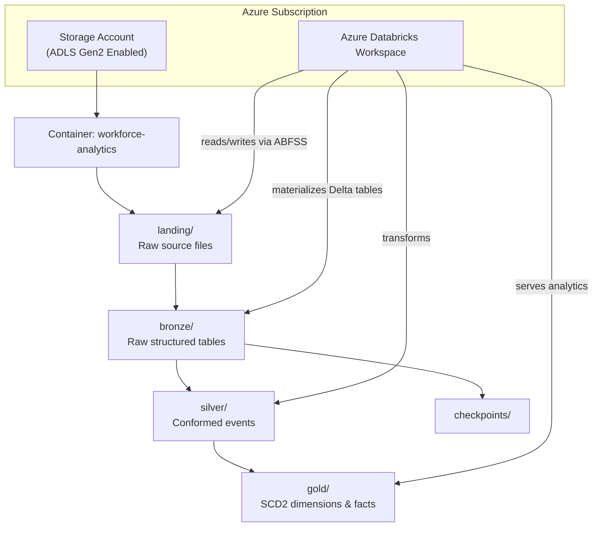
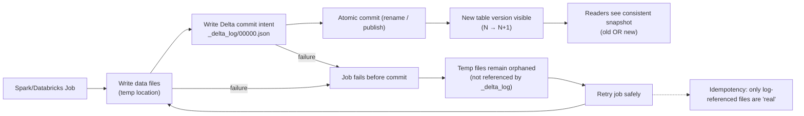

# azure-databricks-workforce-analytics

This project demonstrates a pragmatic, Azure-native analytics engineering platform built on **Azure Databricks**, **Delta Lake**, and **SQL‑first ELT**. It models synthetic workforce data using a governed **bronze → silver → gold** architecture and produces stable, point‑in‑time datasets suitable for real enterprise reporting.

The goal is to show how legacy, manual workflows can be replaced with deterministic pipelines, clear lineage, and durable dimensional models that support accurate historical analysis.

---

## What This Project Demonstrates

This project showcases practical, enterprise-grade analytics engineering patterns implemented on Azure Databricks and Delta Lake. It demonstrates the ability to:

- Build a governed lakehouse using **bronze → silver → gold** layers  
- Implement **incremental ingestion** and **SCD Type 2** dimensional modeling  
- Design **configuration-driven pipelines** that reduce code duplication  
- Orchestrate deterministic SQL transformations with **Databricks Workflows**  
- Produce **point-in-time datasets** that support accurate historical reporting  
- Apply **metadata-driven documentation** and machine-readable patterns  
- Separate storage, compute, and code for clean operational boundaries  

The goal is to reflect how real organizations modernize legacy workflows into stable, auditable, and scalable data platforms.

---

## Architecture Overview

The implementation emphasizes pragmatic system design under real-world constraints:

- Incremental processing
- Dimensional modeling (SCD Type 2)
- Configuration-driven ingestion
- Deterministic SQL transformations
- Orchestration via Databricks Workflows
- Governed, point-in-time datasets

AI-assisted development is used internally to accelerate scaffolding and documentation.  
All pipelines remain deterministic, testable, and auditable.

---

## Data Model Overview

The gold layer contains a small but representative dimensional model built using SCD Type 2 patterns and point‑in‑time logic. These models mirror the structures commonly used in real workforce analytics systems.

### Dimensions

- **dim_employee** (SCD Type 2)  
  Tracks employment attributes over time, including department, manager, job role, and status changes.

- **dim_date**  
  Standard calendar dimension used for reporting alignment and time‑series analysis.

### Facts

- **fact_employee_events**  
  Conformed event table representing hires, terminations, transfers, promotions, and compensation changes.

- **fact_headcount_snapshot**  
  Point‑in‑time table that reconstructs workforce composition for any historical date using effective‑date logic.

### Modeling Patterns

- Surrogate keys  
- Effective date and end‑date logic  
- Deterministic merge patterns  
- Late‑arriving data handling  
- Point‑in‑time reconstruction  

These patterns ensure accurate historical reporting, stable BI consumption, and predictable downstream behavior.

---

## Data Quality & Validation

The project includes lightweight but meaningful validation patterns to ensure that each layer of the pipeline behaves predictably and produces trustworthy outputs.

### Validation Patterns

- **Schema validation (bronze)**  
  Confirms that raw ingested files match expected column structures before being materialized as Delta tables.

- **Row‑count reconciliation**  
  Compares landing vs. bronze counts to detect ingestion gaps or malformed source files.

- **SCD2 change detection**  
  Ensures that only true attribute changes generate new dimension records, preventing unnecessary bloat.

- **Primary‑key and surrogate‑key integrity checks**  
  Validates that gold‑layer dimensions and facts maintain referential consistency.

- **Metric validation for headcount and events**  
  Confirms that headcount totals, hire/termination counts, and event distributions align with expected business logic.

These checks run as part of the gold‑layer workflows and provide early detection of data drift, ingestion issues, or modeling inconsistencies.

---

## Storage Layer (ADLS Gen2)

**ADLS Gen2** is Azure Blob Storage with **hierarchical namespace enabled at the storage-account level**.

Enabling hierarchical namespace converts flat object storage into a true data lake by providing:

- Real directory structures
- POSIX-like ACLs
- Atomic rename and move operations
- Optimized performance for Spark and Databricks workloads

This capability is required for reliable Delta Lake pipelines.

---

## System Architecture



---

## Separation of Concerns

- **GitHub/Databricks Repos**  
  Code only: Python, SQL, notebooks, workflows, documentation

- **ADLS Gen2**  
  Data only: landing → bronze → silver → gold

- **Azure Databricks**  
  Execution engine: orchestration, transformation, validation

---

## Project Structure

```text
docs/                → Architecture & modeling documentation
ingestion/           → Config-driven ingestion framework
transformations/
    bronze/          → Raw structured tables
    silver/          → Conformed events
    gold/            → SCD2 dimensions & data quality checks
workflows/           → Databricks job definitions
```

---

## How to Run This Project

This section provides a minimal, practical guide for running the pipelines in an Azure Databricks workspace.

### Prerequisites

- Azure Databricks workspace  
- ADLS Gen2 storage account with **hierarchical namespace enabled**  
- Cluster or SQL warehouse with access to the storage account  
- Service principal with RBAC + ACL permissions on the lake  
- Databricks Repos or GitHub integration enabled  

### Setup Steps

1. **Clone the repository** into Databricks Repos.  
2. **Create a secret scope** backed by Azure Key Vault for service‑principal credentials.  
3. **Update configuration files** in `ingestion/` with your storage paths and secrets.  
4. **Deploy workflows** in the `workflows/` directory using the Databricks UI or API.  
5. **Run the ingestion workflow** to populate bronze tables.  
6. **Run the transformation workflows** to materialize silver and gold layers.  

All transformations are deterministic and idempotent — rerunning a job produces the same result.

---

## Design Philosophy

This project intentionally avoids unnecessary abstraction and focuses on:

- Transparent SQL logic  
- Clear lineage  
- Deterministic data transformations  
- Governance under constraint  
- Reproducible analytics engineering patterns  

The goal is not novelty — it is **durability and clarity**.

### Atomic Rename and Why It Matters


Modern analytics engines (Spark, Databricks, Delta Lake) publish datasets using a **write-then-rename** pattern:

1. Data is written to a temporary location
2. Once the write succeeds, the directory is **atomically renamed** into place

An **atomic rename** guarantees that a dataset becomes visible **all at once or not at all**.  
Readers will never observe partially written files or mixed versions of data.

This capability is critical for:
- Safe concurrent reads and writes
- Reliable job retries
- Correct checkpointing
- ACID-compliant Delta Lake transactions

Atomic rename is only guaranteed when using **ADLS Gen2 with hierarchical namespace enabled**.  
Flat blob storage does not provide this guarantee and can expose partial results, leading to silent data corruption.

---



---

**Failure/Retry behavior:** If a job fails before the atomic commit, any partially written data remains in a temp location and is **not referenced** by the Delta transaction log. Readers ignore it. A retry can safely re-run the write because only files referenced in `_delta_log` are considered part of the table. This is a key mechanism behind Delta’s durability and idempotent retry behavior.

---

## Architecture Rationale

This project is intentionally designed to reflect the constraints and realities of enterprise analytics engineering.  
The architecture prioritizes durability, clarity, and correctness over novelty.

### Auditability

Delta Lake’s transaction log and atomic commit behavior ensure that every table version is fully traceable.  
Historical views remain consistent, and point‑in‑time reconstruction is always possible.

### Reliability

Incremental ingestion, deterministic SQL transformations, and idempotent retry behavior reduce operational failures and make pipelines predictable under load.

### Governance

Layered storage (landing → bronze → silver → gold) provides clear lineage and controlled data evolution.  
Each layer has a defined purpose, making system behavior explainable to both technical and non‑technical stakeholders.

### Scalability

Configuration‑driven ingestion and reusable SQL patterns reduce engineering overhead and make it easy to onboard new data sources or extend existing models.

### BI Enablement

Gold‑layer models provide stable, point‑in‑time datasets that support Tableau, Power BI, and other BI tools without requiring analysts to write SQL or understand upstream complexity.

The emphasis is on building systems that remain stable over time — systems that analysts trust, engineers can maintain, and organizations can scale.

