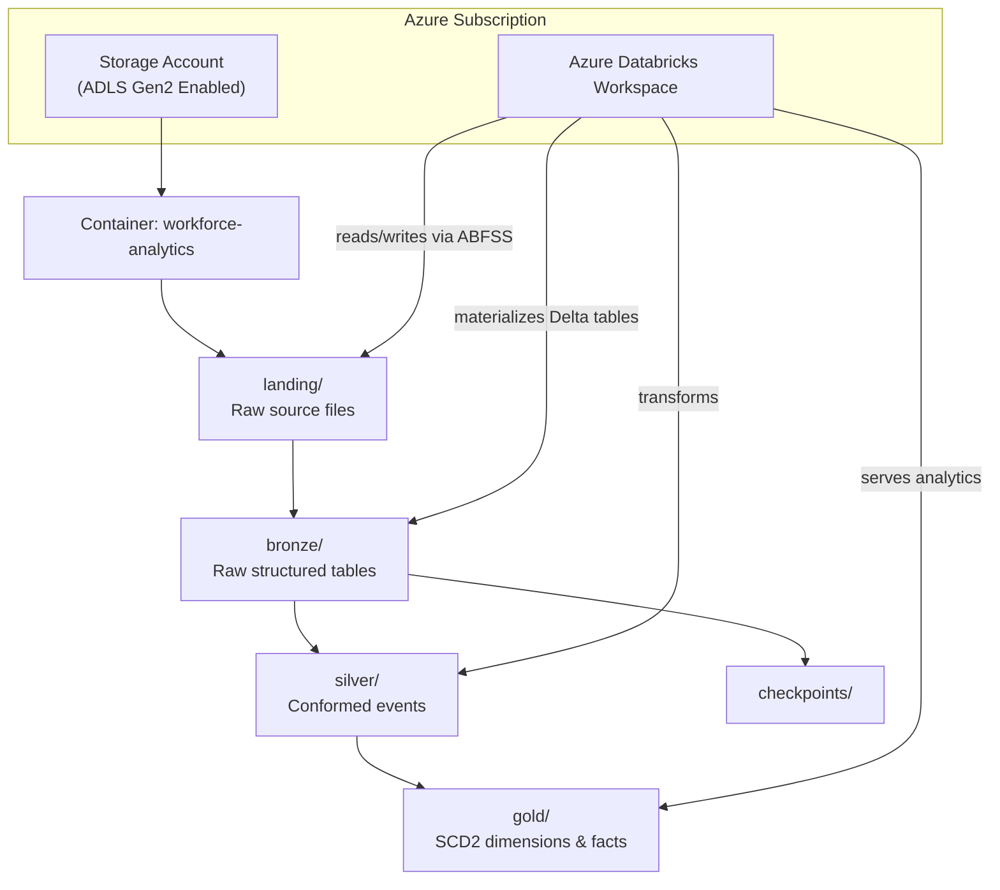
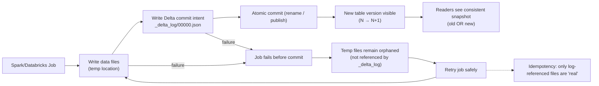

# Workforce Analytics — Databricks‑Native Method

This folder contains the **Databricks‑native, SQL‑first implementation** of the Workforce Analytics domain.  
It demonstrates how this domain is executed using:

- metadata‑driven ingestion  
- medallion architecture  
- SQL transformations  
- SCD Type 2 modeling  
- point‑in‑time reconstruction  
- Databricks Workflows orchestration  
- Delta Lake ACID transactions and atomic commits  

This README is the **authoritative, method‑specific execution guide**.  
It explains:

- What documents exist  
- Which ones are used at runtime  
- How the Databricks‑Native execution architecture works  
- How data flows from landing → bronze → silver → gold  
- Why ADLS Gen2 + Delta Lake matter  
- How SCD2 + PIT modeling is implemented  

---

## Repository Layout (Method‑Specific)

```
workforce/
  databricks-native/
    README.md                ← You are here
    sql/
      bronze/                ← Raw → bronze ingestion SQL
      silver/                ← SCD2 + PIT logic
      gold/                  ← Dimensional + reporting models
  ingestion/
    config/
      sources.yaml           ← Runtime metadata input
    python/workforce_ingest/
      config.py              ← Loads YAML → SourceSpec
      runner.py              ← Executes ingestion
      transformations/       ← Python helpers (optional)
  docs/                      ← Human documentation (not executed)
```

---

## What Documents Are Actually Used at Runtime

| Document | Used By | Purpose |
|---------|---------|---------|
| `sources.yaml` | Python ingestion | Defines landing paths, formats, bronze/silver tables, keys |
| `config.py` | Python ingestion | Converts YAML → typed `SourceSpec` objects |
| `runner.py` | Databricks job | Executes ingestion for each source |
| `sql/bronze/*.sql` | Databricks SQL engine | Load raw → bronze |
| `sql/silver/*.sql` | Databricks SQL engine | SCD2 + PIT logic |
| `sql/gold/*.sql` | Databricks SQL engine | Final dimensional models |
| `docs/*.md` | Humans only | Architecture, modeling, explanations |

Everything else is scaffolding.

---

## Execution Architecture (Databricks‑Native)

This method uses **SQL‑first ELT** orchestrated by Databricks Workflows.

### High‑Level Flow

```
sources.yaml
    ↓
config.py → SourceSpec objects
    ↓
runner.py (Databricks job)
    ↓
Bronze SQL (raw → bronze)
    ↓
Silver SQL (SCD2 + PIT)
    ↓
Gold SQL (dimensional models)
```

---

## Detailed Ingestion Flow

### Metadata Loading
```
sources.yaml
   └── defines:
         - format
         - landing_relpath
         - bronze_table
         - silver_table
         - keys
```

### Python Ingestion Layer
```
config.py
   └── load_sources_yaml()
         └── creates dict[str, SourceSpec]

runner.py
   └── for each source in SOURCES:
         └── executes bronze SQL
```

---

### Storage Architecture (ADLS Gen2)

**ADLS Gen2** is Azure Blob Storage with **hierarchical namespace enabled**.

This enables:

- Real directory structures  
- POSIX‑like ACLs  
- Atomic rename operations  
- Optimized performance for Spark and Delta Lake  

Hierarchical namespace is **required** for reliable Delta Lake pipelines.

---

### System Architecture Diagram



---

## Why Atomic Rename Matters

Modern analytics engines (Spark, Databricks, Delta Lake) publish datasets using a **write‑then‑rename** pattern:

1. Write data to a temporary directory  
2. Write Delta commit intent (`_delta_log/00000.json`)  
3. Atomically rename the directory into place  

Atomic rename ensures:

- A dataset becomes visible **all at once or not at all**  
- Readers never see partial writes  
- Retries are safe and idempotent  
- Delta Lake ACID guarantees hold  

This is only possible with **ADLS Gen2 hierarchical namespace**.

---

## Atomic Commit Diagram



---

## Modeling Patterns (Silver → Gold)

The Databricks‑Native method implements:

- **SCD Type 2 dimensions**  
- **Point‑in‑time reconstruction**  
- **Surrogate keys**  
- **Effective‑date logic**  
- **Late‑arriving data handling**  
- **Deterministic merge patterns**  

These patterns ensure:

- Accurate historical reporting  
- Stable BI consumption  
- Predictable downstream behavior  

---

## Data Quality & Validation

Validation patterns include:

- Schema validation (bronze)  
- Row‑count reconciliation  
- SCD2 change detection  
- Primary‑key and surrogate‑key integrity checks  
- Metric validation for headcount and events  

These checks run as part of the gold‑layer workflows.

---

## Separation of Concerns

- **GitHub / Databricks Repos** → Code only  
- **ADLS Gen2** → Data only  
- **Databricks** → Execution engine  

This keeps the system clean, governed, and maintainable.

---

## How to Run This Method

### Prerequisites

- Azure Databricks workspace  
- ADLS Gen2 with hierarchical namespace  
- Cluster or SQL warehouse  
- Service principal with RBAC + ACL permissions  
- Databricks Repos enabled  

### Steps

1. Clone the repo into Databricks Repos  
2. Configure secrets + storage paths  
3. Deploy workflows  
4. Run ingestion (bronze)  
5. Run transformations (silver → gold)  

All transformations are deterministic and idempotent.

---

## Design Philosophy

This method prioritizes:

- Transparent SQL  
- Deterministic transformations  
- Clear lineage  
- Durable modeling patterns  
- Enterprise‑grade reliability  

The goal is **clarity, durability, and correctness**, not novelty.
